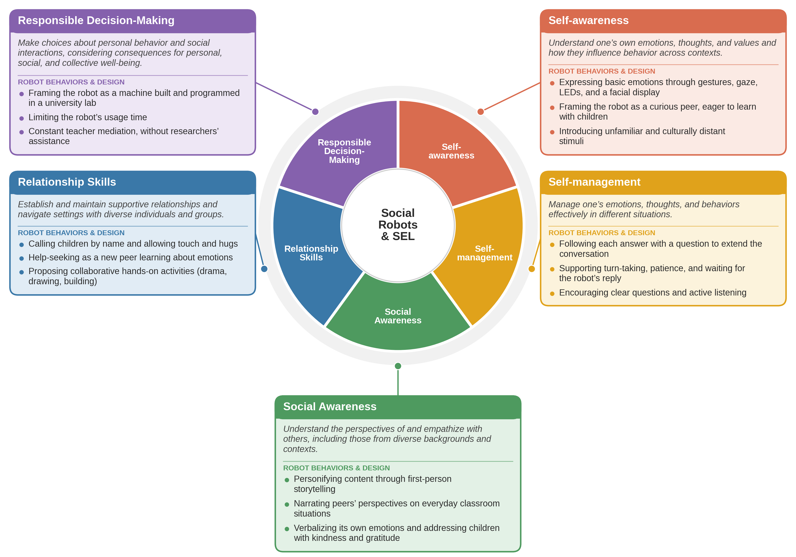

# Social-Robots-SEL-Framework

This repository contains the materials used to integrate a robot activity into a SEL program.

The folder includes the prompt used to generate the robot’s responses, the script for one of the activities, and the related application.
